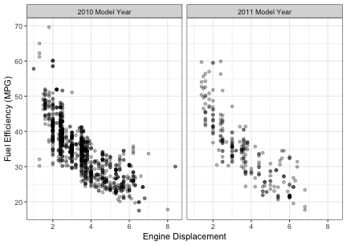
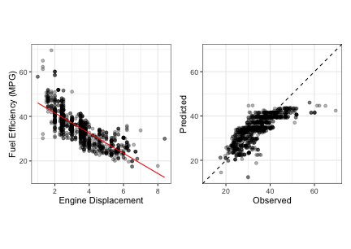
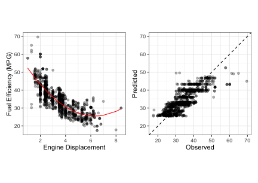
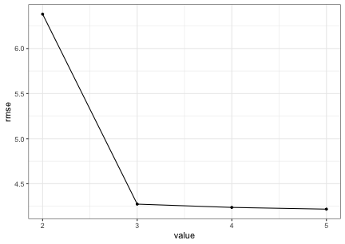
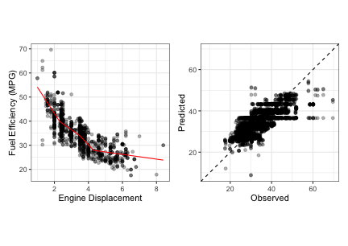
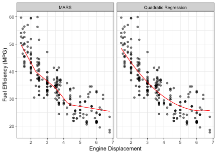

# Chapter 2 - A Short Tour of the Predictive Modeling Process


```r
library(tidymodels)
```

```
## ── Attaching packages ────────────────────────────────────── tidymodels 0.1.1 ──
```

```
## ✔ broom     0.7.0      ✔ recipes   0.1.13
## ✔ dials     0.0.9      ✔ rsample   0.0.8 
## ✔ dplyr     1.0.2      ✔ tibble    3.0.3 
## ✔ ggplot2   3.3.2      ✔ tidyr     1.1.2 
## ✔ infer     0.5.2      ✔ tune      0.1.1 
## ✔ modeldata 0.0.2      ✔ workflows 0.2.1 
## ✔ parsnip   0.1.3      ✔ yardstick 0.0.7 
## ✔ purrr     0.3.4
```

```
## ── Conflicts ───────────────────────────────────────── tidymodels_conflicts() ──
## ✖ purrr::discard() masks scales::discard()
## ✖ dplyr::filter()  masks stats::filter()
## ✖ dplyr::lag()     masks stats::lag()
## ✖ recipes::step()  masks stats::step()
```

```r
library(AppliedPredictiveModeling)
library(patchwork)
library(sessioninfo)
library(conflicted)

## -----------------------------------------------------------------------------

conflict_prefer("filter", winner = "dplyr", quiet = TRUE)
conflict_prefer("select", winner = "dplyr", quiet = TRUE)

## -----------------------------------------------------------------------------

theme_set(theme_bw())

## -----------------------------------------------------------------------------

options(width = 100, digits = 3)
options(dplyr.print_min = 6, dplyr.print_max = 6)
options(cli.width = 85)
options(crayon.enabled = FALSE)

opts_chunk$set(
  digits = 3,
  fig.align = 'center',
  fig.width = 6,
  fig.height = 4.25
)
```

## 2.1 Case Study: Predicting Fuel Economy

The data are contained in several data frames. The analysis in this chapter only uses the 2010 and 2011 data. 


```r
data(FuelEconomy)
ls()
```

```
## [1] "cars2010" "cars2011" "cars2012"
```

The relationship between engine displacement and fuel efficiency of all 2010 model year vehicles and new 2011 car lines: 


```r
cars2010 %>% 
 mutate(Year = "2010 Model Year") %>% 
 bind_rows(
  cars2011 %>% 
   mutate(Year = "2011 Model Year")
 ) %>% 
 ggplot(aes(x = EngDispl, y = FE)) + 
 geom_point(alpha = .3) + 
 facet_wrap(~ Year) + 
 xlab("Engine Displacement") + 
 ylab("Fuel Efficiency (MPG)")
```



Create resampling folds for the 2010 data: 


```r
set.seed(121)
folds_2010 <- vfold_cv(cars2010)
```


Fit a linear regression model with a single linear term for engine displacement:


```r
# Setup the model type and use `lm()` to fit the model: 
lm_spec <- linear_reg() %>% set_engine("lm")

# Create a control object that will save the out-of-sample predictions. 
ctrl <- control_resamples(save_pred = TRUE)

# Perform 10-fold cross-validation on the linear regression
lm_lin_resamples <- 
 lm_spec %>% 
 fit_resamples(FE ~ EngDispl, resamples = folds_2010, control = ctrl)

# Fit the linear model on the 2010 data
lm_lin_fit <- lm_spec %>% fit(FE ~ EngDispl, data = cars2010)

tidy(lm_lin_fit)
```

```
## # A tibble: 2 x 5
##   term        estimate std.error statistic   p.value
##   <chr>          <dbl>     <dbl>     <dbl>     <dbl>
## 1 (Intercept)    50.6      0.398     127.  0.       
## 2 EngDispl       -4.52     0.106     -42.5 2.09e-234
```
A function for creating plots of the predicted line and the observed versus predicted results: 


```r
fuel_plots <- function(resamples, fit) {
 pred_line <- 
  predict(fit, cars2010) %>% 
  bind_cols(cars2010) %>% 
  arrange(EngDispl)
 
 profile_plot <- 
  cars2010 %>% 
  ggplot(aes(x = EngDispl, y = FE)) + 
  geom_point(alpha = .3) + 
  geom_line(data = pred_line, aes(y = .pred), col = "red") +
  xlab("Engine Displacement") + 
  ylab("Fuel Efficiency (MPG)")
 
 obs_vs_pred <- 
  collect_predictions(resamples) %>% 
  ggplot(aes(x = FE, y = .pred)) + 
  geom_abline(lty = 2) + 
  geom_point(alpha = .3) + 
  coord_obs_pred() + 
  xlab("Observed") + 
  ylab("Predicted")
 
 profile_plot + obs_vs_pred
}
```

 Quality of fit diagnostics for the linear regression model. The training set data and its associated predictions are used to understand how well the model works: 
 

```r
fuel_plots(lm_lin_resamples, lm_lin_fit)
```



The resampled RMSE: 


```r
collect_metrics(lm_lin_resamples)
```

```
## # A tibble: 2 x 5
##   .metric .estimator  mean     n std_err
##   <chr>   <chr>      <dbl> <int>   <dbl>
## 1 rmse    standard   4.62     10  0.0874
## 2 rsq     standard   0.620    10  0.0131
```

Now add a quadratic term to the linear model. 


```r
lm_quad_resamples <- 
 lm_spec %>% 
 fit_resamples(FE ~ EngDispl + I(EngDispl^2), resamples = folds_2010, control = ctrl)

lm_quad_fit <- lm_spec %>% fit(FE ~ EngDispl + I(EngDispl^2), data = cars2010)
tidy(lm_quad_fit)
```

```
## # A tibble: 3 x 5
##   term          estimate std.error statistic  p.value
##   <chr>            <dbl>     <dbl>     <dbl>    <dbl>
## 1 (Intercept)     63.2      0.948       66.7 0.      
## 2 EngDispl       -11.9      0.516      -23.0 7.31e-96
## 3 I(EngDispl^2)    0.935    0.0645      14.5 1.07e-43
```

Quality of fit diagnostics for the quadratic regression model (using the training set):


```r
fuel_plots(lm_quad_resamples, lm_quad_fit)
```



Resampled RMSE goes down: 


```r
collect_metrics(lm_quad_resamples)
```

```
## # A tibble: 2 x 5
##   .metric .estimator  mean     n std_err
##   <chr>   <chr>      <dbl> <int>   <dbl>
## 1 rmse    standard   4.24     10  0.0641
## 2 rsq     standard   0.679    10  0.0143
```

Tune a MARS model to the data, evaluating a model with two to five features: 


```r
mars_spec <- 
 mars(num_terms = tune(), prune_method = "none") %>% 
 set_engine("earth") %>% 
 set_mode("regression")

ctrl <- control_grid(save_pred = TRUE)

mars_tune <-
 mars_spec %>%
 tune_grid(
  FE ~ EngDispl,
  resamples = folds_2010,
  control = ctrl,
  grid = tibble(num_terms = 2:5)
 )
```

The cross-validation profile for the MARS tuning parameter:


```r
autoplot(mars_tune, metric = "rmse")
```



Selecting the best tuning parameters: 


```r
# Show the top results:
show_best(mars_tune, metric = "rmse")
```

```
## # A tibble: 4 x 7
##   num_terms .metric .estimator  mean     n std_err .config
##       <int> <chr>   <chr>      <dbl> <int>   <dbl> <chr>  
## 1         5 rmse    standard    4.22    10  0.0658 Model4 
## 2         4 rmse    standard    4.24    10  0.0643 Model3 
## 3         3 rmse    standard    4.27    10  0.0635 Model2 
## 4         2 rmse    standard    6.38    10  0.125  Model1
```

```r
# Pick the numerically best:
mars_param <- select_best(mars_tune, metric = "rmse")
mars_param
```

```
## # A tibble: 1 x 2
##   num_terms .config
##       <int> <chr>  
## 1         5 Model4
```

```r
# Update the model to substitute the value of `tune()` with
# the chosen value, then fit the model. 
mars_fit <- 
 mars_spec %>% 
 finalize_model(mars_param) %>% 
 fit(FE ~ EngDispl, data = cars2010)

# The fitted MARS terms:
cat(format(mars_fit$fit))
```

```
##   18
##   +  5.94 * h(EngDispl-2.3)
##   -  2.55 * h(EngDispl-3.5)
##   +  10.9 * h(4.3-EngDispl)
##   -  4.38 * h(EngDispl-4.3)
```


Quality of fit diagnostics for the MARS model (using the training set). The MARS model creates several linear regression fits with change points at 2.3, 3.5, and 4.3 L:


```r
fuel_plots(mars_tune, mars_fit)
```



The test set data and with model fits for two models: 


```r
# Predict the test set using the two best models

lm_quad_test_res <- 
 lm_quad_fit %>% 
 predict(cars2011) %>% 
 bind_cols(cars2011) %>% 
 mutate(model = 'Quadratic Regression')

mars_test_res <- 
 mars_fit %>% 
 predict(cars2011) %>% 
 bind_cols(cars2011) %>% 
 mutate(model = 'MARS') 

lm_quad_test_res  %>% 
 bind_rows(mars_test_res) %>% 
 ggplot(aes(x = EngDispl, y = FE)) + 
 geom_point(alpha = .5) + 
 geom_line(aes(y = .pred), col = "red") +
 facet_wrap(~ model) +
 xlab("Engine Displacement") + 
 ylab("Fuel Efficiency (MPG)")
```


The test set statistics:


```r
lm_quad_test_res %>% rmse(FE, .pred)
```

```
## # A tibble: 1 x 3
##   .metric .estimator .estimate
##   <chr>   <chr>          <dbl>
## 1 rmse    standard        4.72
```

```r
mars_test_res %>% rmse(FE, .pred)
```

```
## # A tibble: 1 x 3
##   .metric .estimator .estimate
##   <chr>   <chr>          <dbl>
## 1 rmse    standard        4.67
```


## Session Information


```r
session_info()
```

```
## ─ Session info ───────────────────────────────────────────────────────────────────────────────────
##  setting  value                       
##  version  R version 4.0.2 (2020-06-22)
##  os       macOS Catalina 10.15.5      
##  system   x86_64, darwin17.0          
##  ui       X11                         
##  language (EN)                        
##  collate  en_US.UTF-8                 
##  ctype    en_US.UTF-8                 
##  tz       America/New_York            
##  date     2020-10-10                  
## 
## ─ Packages ───────────────────────────────────────────────────────────────────────────────────────
##  package                   * version    date       lib source        
##  AppliedPredictiveModeling * 1.1-7      2018-05-22 [1] CRAN (R 4.0.2)
##  assertthat                  0.2.1      2019-03-21 [1] CRAN (R 4.0.0)
##  backports                   1.1.10     2020-09-15 [1] CRAN (R 4.0.2)
##  broom                     * 0.7.0      2020-07-09 [1] CRAN (R 4.0.0)
##  class                       7.3-17     2020-04-26 [1] CRAN (R 4.0.2)
##  cli                         2.0.2      2020-02-28 [1] CRAN (R 4.0.0)
##  cluster                     2.1.0      2019-06-19 [1] CRAN (R 4.0.2)
##  codetools                   0.2-16     2018-12-24 [1] CRAN (R 4.0.2)
##  colorspace                  1.4-1      2019-03-18 [1] CRAN (R 4.0.0)
##  conflicted                * 1.0.4      2019-06-21 [1] CRAN (R 4.0.1)
##  CORElearn                   1.54.2     2020-02-08 [1] CRAN (R 4.0.0)
##  crayon                      1.3.4      2017-09-16 [1] CRAN (R 4.0.2)
##  dials                     * 0.0.9      2020-09-16 [1] CRAN (R 4.0.2)
##  DiceDesign                  1.8-1      2019-07-31 [1] CRAN (R 4.0.0)
##  digest                      0.6.25     2020-02-23 [1] CRAN (R 4.0.0)
##  dplyr                     * 1.0.2      2020-08-18 [1] CRAN (R 4.0.0)
##  earth                     * 5.2.090    2011-06-06 [1] CRAN (R 4.0.2)
##  ellipse                     0.4.2      2020-05-27 [1] CRAN (R 4.0.2)
##  ellipsis                    0.3.1      2020-05-15 [1] CRAN (R 4.0.0)
##  evaluate                    0.14       2019-05-28 [1] CRAN (R 4.0.0)
##  fansi                       0.4.1      2020-01-08 [1] CRAN (R 4.0.0)
##  farver                      2.0.3      2020-01-16 [1] CRAN (R 4.0.0)
##  foreach                     1.5.0      2020-03-30 [1] CRAN (R 4.0.2)
##  Formula                     1.2-3      2018-05-03 [1] CRAN (R 4.0.0)
##  furrr                       0.1.0      2018-05-16 [1] CRAN (R 4.0.0)
##  future                      1.19.1     2020-09-22 [1] CRAN (R 4.0.2)
##  generics                    0.0.2      2018-11-29 [1] CRAN (R 4.0.0)
##  ggplot2                   * 3.3.2      2020-06-19 [1] CRAN (R 4.0.0)
##  globals                     0.13.0     2020-09-17 [1] CRAN (R 4.0.2)
##  glue                        1.4.2      2020-08-27 [1] CRAN (R 4.0.2)
##  gower                       0.2.2      2020-06-23 [1] CRAN (R 4.0.0)
##  GPfit                       1.0-8      2019-02-08 [1] CRAN (R 4.0.0)
##  gtable                      0.3.0      2019-03-25 [1] CRAN (R 4.0.0)
##  hardhat                     0.1.4      2020-07-02 [1] CRAN (R 4.0.2)
##  highr                       0.8        2019-03-20 [1] CRAN (R 4.0.0)
##  infer                     * 0.5.2      2020-06-14 [1] CRAN (R 4.0.0)
##  ipred                       0.9-9      2019-04-28 [1] CRAN (R 4.0.2)
##  iterators                   1.0.12     2019-07-26 [1] CRAN (R 4.0.0)
##  knitr                     * 1.30       2020-09-22 [1] CRAN (R 4.0.2)
##  labeling                    0.3        2014-08-23 [1] CRAN (R 4.0.0)
##  lattice                     0.20-41    2020-04-02 [1] CRAN (R 4.0.2)
##  lava                        1.6.8      2020-09-26 [1] CRAN (R 4.0.2)
##  lhs                         1.1.1      2020-10-05 [1] CRAN (R 4.0.2)
##  lifecycle                   0.2.0      2020-03-06 [1] CRAN (R 4.0.0)
##  listenv                     0.8.0      2019-12-05 [1] CRAN (R 4.0.0)
##  lubridate                   1.7.9      2020-06-08 [1] CRAN (R 4.0.2)
##  magrittr                    1.5        2014-11-22 [1] CRAN (R 4.0.0)
##  MASS                        7.3-51.6   2020-04-26 [1] CRAN (R 4.0.2)
##  Matrix                      1.2-18     2019-11-27 [1] CRAN (R 4.0.2)
##  memoise                     1.1.0      2017-04-21 [1] CRAN (R 4.0.0)
##  modeldata                 * 0.0.2      2020-06-22 [1] CRAN (R 4.0.2)
##  munsell                     0.5.0      2018-06-12 [1] CRAN (R 4.0.0)
##  nnet                        7.3-14     2020-04-26 [1] CRAN (R 4.0.2)
##  parsnip                   * 0.1.3      2020-08-04 [1] CRAN (R 4.0.2)
##  patchwork                 * 1.0.1      2020-06-22 [1] CRAN (R 4.0.0)
##  pillar                      1.4.6      2020-07-10 [1] CRAN (R 4.0.0)
##  pkgconfig                   2.0.3      2019-09-22 [1] CRAN (R 4.0.0)
##  plotmo                      3.6.0      2020-09-13 [1] CRAN (R 4.0.2)
##  plotrix                     3.7-8      2020-04-16 [1] CRAN (R 4.0.0)
##  plyr                        1.8.6      2020-03-03 [1] CRAN (R 4.0.2)
##  pROC                        1.16.2     2020-03-19 [1] CRAN (R 4.0.2)
##  prodlim                     2019.11.13 2019-11-17 [1] CRAN (R 4.0.0)
##  purrr                     * 0.3.4      2020-04-17 [1] CRAN (R 4.0.0)
##  R6                          2.4.1      2019-11-12 [1] CRAN (R 4.0.0)
##  Rcpp                        1.0.5      2020-07-06 [1] CRAN (R 4.0.0)
##  recipes                   * 0.1.13     2020-06-23 [1] CRAN (R 4.0.2)
##  reshape2                    1.4.4      2020-04-09 [1] CRAN (R 4.0.2)
##  rlang                       0.4.7      2020-07-09 [1] CRAN (R 4.0.0)
##  rpart                       4.1-15     2019-04-12 [1] CRAN (R 4.0.2)
##  rpart.plot                  3.0.8      2019-08-22 [1] CRAN (R 4.0.0)
##  rsample                   * 0.0.8      2020-09-23 [1] CRAN (R 4.0.2)
##  rstudioapi                  0.11       2020-02-07 [1] CRAN (R 4.0.0)
##  scales                    * 1.1.1      2020-05-11 [1] CRAN (R 4.0.2)
##  sessioninfo               * 1.1.1      2018-11-05 [1] CRAN (R 4.0.2)
##  stringi                     1.5.3      2020-09-09 [1] CRAN (R 4.0.2)
##  stringr                     1.4.0      2019-02-10 [1] CRAN (R 4.0.0)
##  survival                    3.1-12     2020-04-10 [1] CRAN (R 4.0.2)
##  TeachingDemos               2.12       2020-04-07 [1] CRAN (R 4.0.0)
##  tibble                    * 3.0.3      2020-07-10 [1] CRAN (R 4.0.0)
##  tidymodels                * 0.1.1      2020-07-14 [1] CRAN (R 4.0.0)
##  tidyr                     * 1.1.2      2020-08-27 [1] CRAN (R 4.0.2)
##  tidyselect                  1.1.0      2020-05-11 [1] CRAN (R 4.0.0)
##  timeDate                    3043.102   2018-02-21 [1] CRAN (R 4.0.0)
##  tune                      * 0.1.1      2020-07-08 [1] CRAN (R 4.0.2)
##  utf8                        1.1.4      2018-05-24 [1] CRAN (R 4.0.0)
##  vctrs                       0.3.4      2020-08-29 [1] CRAN (R 4.0.2)
##  withr                       2.3.0      2020-09-22 [1] CRAN (R 4.0.2)
##  workflows                 * 0.2.1      2020-10-08 [1] CRAN (R 4.0.2)
##  xfun                        0.17       2020-09-09 [1] CRAN (R 4.0.2)
##  yardstick                 * 0.0.7      2020-07-13 [1] CRAN (R 4.0.2)
## 
## [1] /Library/Frameworks/R.framework/Versions/4.0/Resources/library
```
